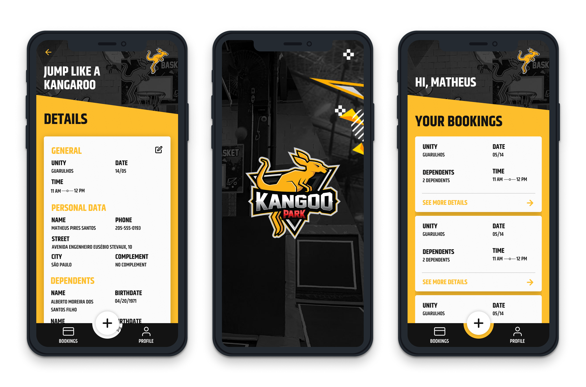

<p align="center">
  
	
  <p align="center">
  Mobile app to see your bookings and book a new date and time to jump at Kangoo Trampoline Park!
  </p>
  
  
</p>

<p align="center">
  

  

  

  <br>

  

  <a href="https://www.linkedin.com/in/mathpsantos/">
    
  </a>
</p>

 
# Index

- :rocket: [Project Summary](#rocket-project-summary)
- 👨‍💻️ [Technologies Used](#%EF%B8%8F-technologies-used)
- 📦️ [How to install the project](#%EF%B8%8F-how-to-install-the-project)
- 🤔️ [How can you contribute?](#%EF%B8%8F-how-can-you-contribute)
 
## :rocket: Project Summary

This Project was made a Kangoo Park company, with the objective that the clients can see and make new bookings in the app in a simple way.
 
## 👨‍💻️ Technologies Used

This project was developed using the technologies bellow:
  
### Mobile

  - [React Native](https://reactnative.dev/)
  - [TypeScript](https://www.typescriptlang.org/)
  
### Dependencies

  - [Styled Components](https://styled-components.com/)
  - [React Navigation](https://reactnavigation.org/)

### Code patterns

  - [ESLint](https://eslint.org/)

### IDE

  - [Visual Studio Code](https://code.visualstudio.com/)

---
 
## 📦️ How to install the project

To clone the project, use the commands bellow:

```bash
  # Clone the repository
  ❯ git clone https://github.com/MathPSantos/KangooPark.git

  # Enter directory
  ❯ cd KangooPark
```

### Mobile

**Emulate in IOS**

```bash
  # Enter mobile directory
  > cd mobile

  # Install the dependencies
  ❯ yarn
  
  # Install the IOS dependencies
  ❯ npx pod-install ios

  # Install and start the project
  ❯ yarn ios
```

**Emulate in Android**

```bash
  # Enter mobile directory
  > cd mobile

  # Install the dependencies
  ❯ yarn
  
  # Install and start the project
  ❯ yarn android
```

---
 
## 🤔️ How can you contribute?

1. `fork` this repository
2. Create a branch with your feature:
   - `$ git checkout -b my_feature`
3. Commit your branch:
   - `$ git commit -m "feature: My new feature"`
4. Submit your branch:
   - `$ git push origin my_feature`

---
 
<h4 align="center">
  Made with ❤️ by Matheus Pires Santos <a href="mailto:matheus.psantos2016@gmail.com">Get in touch!</a>
</h4>
